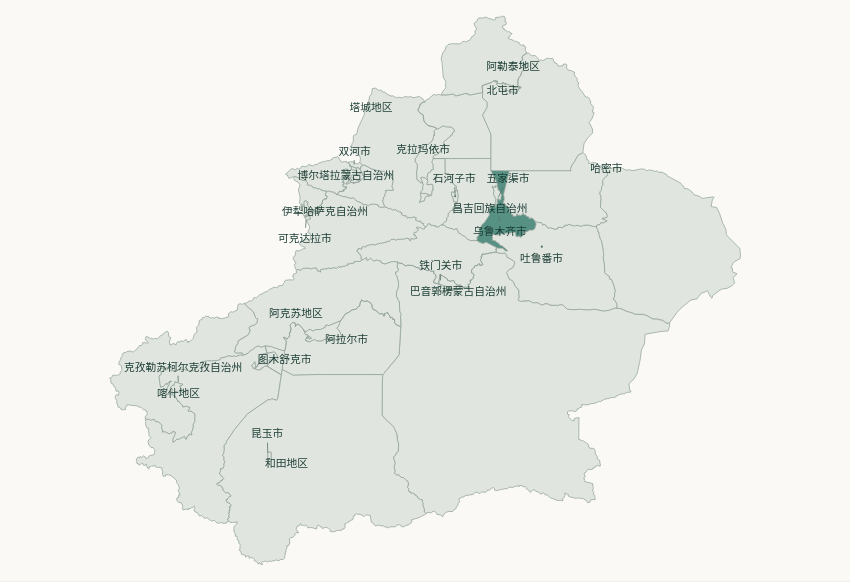
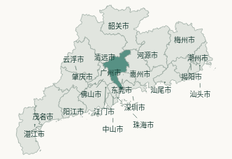
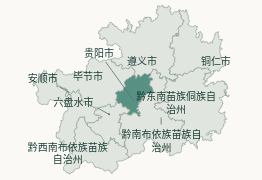
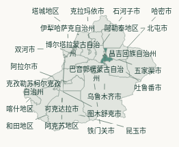
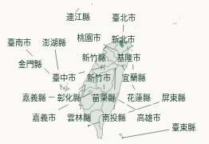

# 省内城市地图标签验证

基于最新 main `f8c635fe41e85fc76f4ec24f44ff42d1e5086b7a`（2026-10-10）。

省内地图将边界、引导线和完整名称分层绘制，避免后绘制的边界遮住文字。
布局为完整名称预留包围盒，并将密集或边缘标签移至最近的可用位置；
引导线连接原地理锚点与标签边缘，透明遮罩让引导线在文字区域留空，保留底图。
城市文字不绘制白色描边、光晕或阴影，默认标签无白色底板；点击交互继续沿用现有回调。
城市名称匹配全国地图省名的 10 SVG 单位字号（850px 地图容器下约 10.76px）；
容器变窄时保留至少 10px 的实际字号，长名称完整换行，必要时增加地图高度。
标签点击沿用城市选择回调；原有边界键盘按钮、完整城市列表及保存保护继续生效。

全国地图（含省名和港澳引导线）、原始地理数据、生成资源、健康、日记和存储协议均未修改。

## 自动检查

- `pnpm lint`、`pnpm typecheck`、`pnpm build:github-pwa` 通过。
  lint 仅有仓库已有的根目录 `pages` 路径提示，无 lint 错误。
- 10 个相关 Vitest 文件、144 项通过，覆盖标签布局、34 省地图资源、
  省市目录、旅行数据/同步/UI、旅行列表、导航/按需加载及导出恢复。
- 标签布局测试逐省检查 218、250、318、540、850px 容器：
  完整名称与原始映射一一对应，字号下限、所有标签包围盒无重叠/越界，
  引导线终点落在标签边缘；额外覆盖 32 个同锚点长名称、增高及确定性。

## 实际浏览器检查

使用最终静态 PWA 构建、Playwright 和系统 Chromium，所有外部请求均被拦截。
GitHub 适配器连接的是内存中的合成仓库，每省一条合成到访；保存也只写内存。
未使用真实认证，未读取私人旅行记录、健康或日记。

逐一检查全部 34 个省级地图，在以下 5 种视口共 170 组场景中：

| 视口 | 场景 |
| --- | --- |
| 1440 × 1000 | 桌面 |
| 768 × 1024 | 平板 |
| 390 × 844 | 手机 |
| 320 × 740 | 窄屏手机 |
| 844 × 390 | 手机横屏 |

每组均核对浏览器实际 SVG 文字包围盒：全部映射名称完整显示、
无标签重叠、无地图边界裁切、无横向溢出，实际字号至少 10px。
另逐标签检查计算样式：无文字描边、文字阴影或滤镜，默认底板完全透明，
引导线的遮罩与完整名称预留区域一一对应。
逐省核对合成已去状态，并用 Enter 选择城市、取消表单。
另检查鼠标边界选择、触屏标签选择、Space 选择、选择高亮、
保持表单的实时缩放、保存中禁止更换城市、延迟请求取消、
地图请求失败时的完整城市列表，以及返回全国后的 34 个省名/5 条引导线。
浏览器没有未捕获页面异常。

## 实际截图

截图来自上述构建与合成数据，不是设计稿；PNG 保留实际地图容器尺寸。

桌面新疆（长自治州名称）：

390px 手机广东（密集城市）：

320px 手机贵州、新疆、台湾（长名称、密集县市与边缘标签）：

## 验证限制

浏览器实测范围是 Chromium，包括触屏模拟；未在真实 iOS Safari 或 Android 设备上实测。
狭窄容器中的密集地图可能需要更多纵向空间；引导线可能相交，文字区域的透明遮罩避免线条穿过名称。
历史地图仍有既有的四个缺失边界（那曲市、新星市、白杨市、胡杨河市），
完整名称继续保留在城市列表中，未猜测或补造地理边界。
未执行真实云端数据读写，未合并或部署。
